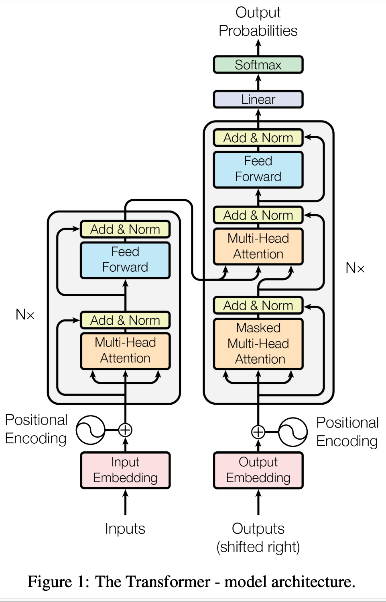

# UNIT 2: Transformer模型原理剖析（1）

Transformer模型是一种用于自然语言处理（NLP）的深度学习模型，主要用于处理序列到序列的任务，如机器翻译、文本生成等。Transformer模型由Vaswani等人在2017年的论文《Attention is All You Need》中首次提出。其核心创新是引入了自注意力机制（Self-Attention），显著提高了并行计算能力和模型性能。

## 一、Transformer 模型的基本架构

Transformer模型主要由两个部分组成：编码器（Encoder）和解码器（Decoder）

在第一个编码器前，通常会有一个输入嵌入层（Input Embedding）和一个位置编码层（Position Embedding）

在解码器后，通常会有一个输出层（Output Layer）

### 输入嵌入层（Input Embedding）
- 将输入序列通过嵌入层映射到高维空间

### 位置编码层（Position Embedding）
- 由于Transformer没有内置的顺序处理能力，位置编码用于注入序列的位置信息

### 编码器（Encoder）
#### 编码器的堆叠结构
- 编码器由多个相同的编码器层堆叠而成，通常有6个或更多层
- 每一层的输出作为下一层的输入，逐层提取更高级的特征

#### 单个编码器层的组成
每个编码器包含两个主要子层：
- 多头自注意机制（Multi-Head Self-Attention）：允许模型在处理每个词时考虑句子中所有的词，从而更好的理解上下文关系。自注意力通过计算词与词之间的相关性来分配权重，使得模型能够捕捉长距离依赖关系。
- 前馈神经网络（Feed-Forward Neural Network）：一个全连接的前馈网络，对每个位置的表示进行独立处理，通常包括两个线性变换（Dense）和一个激活函数（ReLU），用于将输入表示转换为输出表示。

每个子层后都跟着一个残差连接（Residual Connection）和层归一化（Layer Normalization），有助于梯度的流动和模型训练的稳定性。

### 解码器（Decoder）
#### 解码器的堆叠结构
- 解码器也由多个相同的解码器层堆叠而成，通常有6个或更多层
- 每一层的输出作为下一层的输入，不仅提取输出序列的特征，还要整合来自编码器的特征

#### 单个解码器层的组成
- 掩码多头自注意力机制（Masked Multi-Head Self-Attention）：与编码器中的自注意力层类似，但这里使用了掩码（Masking）来防止未来信息的泄露，确保在预测当前词时不会看到后续的词
- 多头交叉注意力机制（Multi-Head Cross-Attention）：这一层允许解码器关注编码器的输出，从而在生成每个词时考虑到输入序列的上下文信息（解码器的每个位置关注编码器输出序列的所有位置）
- 前馈神经网络（Feed-Forward Neural Network）：同编码器中的前馈神经网络

每个子层后都跟着一个残差连接（Residual Connection）和层归一化（Layer Normalization），同编码器。

## 二、Self-Attention机制的原理和计算过程

Self-Attention机制是Transformer模型的核心，它通过为序列中的每个位置分配权重来捕捉全局依赖关系，允许模型在处理序列时考虑整个序列的上下文信息。

### 基本原理
Self-Attention机制的核心思想是：对于序列中的每个元素，计算当前元素与序列中所有元素（包括自身）的关联程度，并分配权重进行加权求和。

### 计算过程
- 输入准备：对于输入序列，需要创建三个向量
  - Query：序列中当前时间步的查询向量（Query Vector），用于与其他全素进行匹配
  - Key：序列中所有时间步的键向量（Key Vector），用于被其他元素的Query 匹配
  - Value：序列中所有时间步的值向量（Value Vector），实际携带的信息内容
- 计算步骤：
  - 生成Q、K、V矩阵
    - 将输入序列 $X(n, d)$ 乘以三个权重矩阵 $W_Q(d, d_k)$、 $W_K(d, d_k)$、 $W_V(d, d_v)$，得到Q、K、V矩阵（ $Q = XW_Q$ , $K = XW_K$, $V = XW_V$ ）
  - 计算注意力分数
    - 使用点积来计算Q、K的相似度，得到注意力分数（ $Attention Score = QK_T$ ）
  - 尺度缩放
    - 为了防止点积值过大，将得到的score除以一个缩放因子 K 维度的平方根（ $Scaled Score = Attention Score/\sqrt{d_k}$ ）
  - Softmax 归一化
    - 应用Softmax 函数使得到的分数转化为概率分布（ $Attention weights = softmax(ScaledScore)$ ）
  - 加权求和
    - 用得到的注意力权重对V向量进行加权求和（ $Output = Attention weights \cdot V$ ）
- 整个注意力的计算过程可以用一个数学公式表示： $Attention(Q, K, V) = softmax(\frac{QK^T}{\sqrt{d_k}}) \cdot V$

### 问题解答

#### 1. $W_Q$ 和 $W_K$ 的shape 为什么是一样的？
在Self-Attention的计算中，会有 $QK^T$ 的计算操作，而 $Q(n, d_q)=X(n, d)W_Q(d, d_q)$， $K(n, d_k)=X(n, d)W_K(d, d_k)$，所以有 $Q(n, d_q)K^T(d_k, n)$，根据矩阵乘法的运算法则，点积计算需要相同的维度，则要求设计 $d_q = d_k$。该设计有以下优势：
- 计算效率的提高：点积计算是Self-Attention的核心操作，为了计算Q、K的相似度，需要对它们的向量进行点积运算，如果两者维度不同，就需要额外的维度对齐和转换操作来对齐这些维度，回增加额外的计算复杂度和时间开销。
- 模型学习能力的提高：
  - 统一的表示空间：当Query和Key的维度相同，它们在同一表示空间中进行点积计算。这意味着它们具有相同的表示能力，可以有效地捕捉到输入序列中不同位置之间的关系。不同位置的Query和Key向量在相同维度空间中进行比较，能够确保Attention机制充分发挥作用。
  - 一致的维度对齐：相同维度的Query和Key使得模型能够在相同的空间中进行计算，确保了计算的公平性和一致性。这种对齐使得Attention机制能够充分挖掘序列中不同位置之间的关系，提高了模型的表达能力和学习能力。

#### 2. 为什么点积运算可以计算两个向量的相似度？
点积（内积）运算在向量空间中尤其几何解释，可以用来衡量两个向量的相似程度。比如给定两个向量 $\mathbf{q}$(Query) 和 $\mathbf{k}$(Key)，它们的点积定义为：

$$\mathbf{q} \cdot \mathbf{k} = \Vert\mathbf{q}\Vert \Vert\mathbf{k}\Vert \cos \theta$$

其中 $\Vert\mathbf{q}\Vert$ 和 $\Vert\mathbf{k}\Vert$ 是向量的范数(长度)， $\theta$ 是两个向量的夹角。点积值反映了两个向量的相似程度：
- **夹角小**（相似度高）：点积值大，表示两个向量在表示空间中较近，模型可以认为这两个位置之间的关系较强。
- **夹角大**（相似度低）：点积值小，表示两个向量在表示空间中较远，模型可以认为这两个位置之间的关系较弱。

与此同时，范数在点积中也具有重要作用：
- 范数的影响：点积值还受到向量范数的影响。较大的范数会放大点积值，从而影响注意力分数的计算。如果两个向量的范数很大，即使它们的夹角很大( $\cos \theta$ 很小)，点积值也可能非常大。反之，如果范数很小，即使夹角小( $\cos \theta$ 很大)，点积值也可能不显著。
- 规范化影响：为了避免由于范数差异导致的点积值过大或过小，通常在计算注意力分数时会进行规范化。例如，使用缩放因子来减小范数带来的影响。这是Self-Attention机制中缩放点积注意力的原因，目的是使得点积值的范围保持在一个合理的范围内，从而保证模型的训练稳定性。

#### 3. 为什么需要除以 $\sqrt{d_k}$ 进行缩放？
在Self-Attention计算中，点积计算得到的分数是两个向量的相似度。为了防止点积值过大，需要对其进行缩放。主要原因如下：
- 数值不稳定：当点积值过大时，经过softmax 归一化时会导致数值不稳定。由于softmax 函数的输出是一个概率分布，如果输入值范围很大，softmax 会将较大的输入值变成非常接近于1的概率，而将较小的输入值变成非常接近于0的概率，这种情况下，softmax的梯度会非常小，导致训练过程中的梯度更新非常不稳定。
- 梯度消失和梯度爆炸：如果没有进行缩放操作，点积值在维度很高的情况下会变得非常大。假设输入向量的维度为 d，点积的值期望大致为d 的数量级，随着d 的增加，点积值会变得越来越大。这会导致梯度爆炸的问题：反向传播过程中，梯度的值会变得非常大，导致模型参数更新过大，从而影响模型训练的稳定性。相反，当模型参数更新时，如果softmax的输入值范围过大，softmax会导致一些梯度变得非常小，进而导致梯度消失的问题：反向传播过程中，梯度的值会变得非常小，导致模型参数更新非常缓慢，影响模型的收敛速度。
- 对于点积值较小的情况影响较小：比如 n1 = 100, n2 = 0.1, dk = 100, 则 $\frac{n1}{\sqrt{dk}} = \frac{100}{10} = 10$， $\frac{n2}{\sqrt{dk}} = \frac{0.1}{10} = 0.01$，可见本身n2已经足够小了，即使再缩小也不会产生较大变化，仍然能够正常的通过softmax 进行归一化处理，而反观点积值较大的情况，则更有效的将其缩放到一个合理范围（想象y轴上100->10，0.1->0.01的变化幅度）。而这也与softmax 函数的性质有关：Softmax函数将点积结果转化为概率分布。即使经过缩放后点积值仍然很小，Softmax函数也会根据这些小的值产生相对平滑的概率分布。缩放操作确保了点积值不会过于极端，从而使得Softmax函数能够有效地处理各种规模的点积值。

#### 4. 为什么要使用softmax 归一化？
- 计算注意力权重：在self-attention 机制中，softmax 函数用于将点积计算得到的相似度分数转化为权重。
- 归一化注意力分数：softmax 函数将注意力分数归一化，使得所有注意力权重的和为1，这样每个Key 对 Query向量的贡献在计算加权和时可以被合理的解释为概率分布。也就是说，softmax 将点积得分转化为一个有效的权重分布，使得不同位置的注意力权重可以进行有效的加权。
- 突出重要位置：通过将点积得分转化为概率分布，softmax 可以突出对特定位置的强注意力，而抑制对其他位置的注意力。比如，如果一个Query向量对某些Key向量的点积得分更高，那么softmax函数将会为这些Key 分配较大的权重，这使得模型能够关注于更相关的信息。
- 平滑处理：softmax 函数将原始的注意力分数平滑成概率分布，这有助于避免极端值对注意力分配的不合理影响。通过这种平滑处理，模型可以有效的处理输入序列中的不同位置，确保信息在整个序列中被适当的整合。
- 确保数值稳定性：详见问题3。

#### 5. 为什么缩放因子使用 $\sqrt{d_k}$ 而不是其他值比如 $d_k$？
- 数学直觉
  - Q 和 K 是两个单独的向量，每个维度可以看作是均值为0，方差为1的随机变量。
  - 它们的点积的方差将是 $d_k$（维度数）。
  - 除以 $\sqrt{d_k}$ 可以将方差归一化到1，使得不同维度的模型有相似的分布。
- 为什么不用 $d_k$
  - 如果使用 $d_k$ 作为缩放因子，会过度压缩点积的值。
  - 这可能导致注意力权重分布过于均匀，失去区分能力。
  - $\sqrt{d_k}$ 提供了一个平衡：既能控制数值范围，又不会过度压缩。

*计算说明*
- 假设有矩阵 $Q(n, d_k)$ 和 $K(n, d_k)$，其中 $n$ 是序列长度， $d_k$ 是每个向量的维度数。
- 计算 $QK^T$，得到的结果是一个 $n*n$ 的矩阵
  - 结果矩阵中每个元素都是 $Q$ 的一行与 $K$ 的一行（ $K^T$ 的一列）的点积。
  - 对于结果矩阵中的元素 $(i, j)$， $(QK^T)_{ij} = Q_i \cdot K_j$
- 单个元素分析
  - $Q_i$ 是 $Q$ 矩阵的第 $i$ 行，是一个长度为 $d_k$ 的向量， $K_j$ 是 $K$ 矩阵的第 $j$ 行，也是一个长度为 $d_k$ 的向量。
  - $Q_i \cdot K_j = q_{i1} * k_{j1} + q_{i2} * k_{j2} + ... + q_{id_k} * k_{jd_k}$
- 方差分析
  - 假设 $Q$ 和 $K$ 中每个元素都是均值为0，方差为1的随机变量。
  - 对于任意的 $(i, j)$， $Q_i \cdot K_j$ 的方差计算如下（因为 $Q_i$ 与 $K_j$ 独立，所以方差可加）：
  
  $$Var(Q_i \cdot K_j) = Var(q_{i1} * k_{j1} + q_{i2} * k_{j2} + ... + q_{id_k} * k_{jd_k}) = Var(q_{i1} * k_{j1}) + Var(q_{i2} * k_{j2}) + ... + Var(q_{id_k} * k_{jd_k})$$
  - 对于每一项 $Var(q_{im} * k_{jm})$：
  
  $$Var(q_{im} * k_{jm}) = E[(q_{im} * k_{jm})^2] - (E[q_{im} * k_{jm}])^2 = E[q_{im}^2] * E[k_{jm}^2] - (E[q_{im}] * E[k_{jm}])^2 = 1 * 1 - 0^2 = 1$$
  - 因此， $Var(Q_i · K_j) = 1 + 1 + ... + 1 (d_k个) = d_k$
- 使用 $\sqrt{d_k}$ 缩放
  
  $$Var(\frac{Q_i · K_j}{\sqrt{d_k}}) = \frac{Var(Q_i · K_j)}{d_k} = \frac{d_k}{d_k} = 1$$

- 这样就保证了不论 $d_k$ 如何变化，使用缩放因子 $\sqrt{d_k}$ 缩放后得到的结果总是稳定为1。

*补充知识*
- 方差的计算公式： 

$$ \begin{aligned} Var(X)  & =  E[(X - E[X])^2] \\ 
& = E[X^2 - 2XE[X] + E[X]^ 2]\\ 
& = E[X^2] - 2E[X]E[X] + E[X]^2 \\ 
& = E[X^2] - E[X]^2 \end{aligned}$$
- 独立性的定义：两个随机变量 X 和 Y相互独立，意味着一个变量的行为不会影响另一个变量。
- 方差的可加性：对于两个独立的随机变量 X 和 Y，我们有： $Var(X + Y) = Var(X) + Var(Y)$，证明如下： 

$$ \begin{aligned} Var(X + Y) & = E[((X + Y) - E[X + Y])^2] \\ 
& = E[((X - E[X]) + (Y - E[Y]))^2] \\ 
& = E[(X - E[X])^2 + 2(X - E[X])(Y - E[Y]) + (Y - E[Y])^2]\\ 
& = E[(X - E[X])^2] + 2E[(X - E[X])(Y - E[Y])] + E[(Y - E[Y])^2] \\ 
& = Var(X) + 2Cov(X,Y) + Var(Y) \end{aligned}$$
- 当 X 和 Y 独立时，它们的协方差 $Cov(X,Y) = 0$，因此： $Var(X + Y) = Var(X) + Var(Y)$
- 扩展到多个变量：这个原理可以扩展到多个独立随机变量。对于独立的 $X_1, X_2, ..., X_n：Var(X_1 + X_2 + ... + X_n) = Var(X_1) + Var(X_2) + ... + Var(X_n)$

#### 6. 怎么理解输入值不合理导致的softmax 梯度消失/梯度爆炸问题？
- TODO

## 三、Multi-Head Attention的设计和作用

multi-head attention 是self-attention 的扩展，也是Transformer模型的核心组件之一。
### 基本构造
- **Query (Q), Key (K), Value (V)**：Multi-Head Attention 将输入序列分别映射为三个向量序列：Query 向量 (Q)，Key 向量 (K)，和 Value 向量 (V)。这些向量用于计算注意力权重。
- **多个注意力头**：不同于传统的单一注意力机制，Multi-Head Attention 将 Q，K，V 分别映射为 $h$ 个不同的子空间，每个子空间对应一个注意力头，每个注意力头都有各自的投影矩阵 $W_i^{Q}$、 $W_i^{K}$、 $W_i^{V}$，i 表示第 i 个注意力头。
- **并行计算**：对每个头，计算注意力得分并得到对应的加权Value向量。
- **连接与投影**：所有头的输出向量连接在一起，并通过一个线性变换（通常是一个投影矩阵）得到最终的输出

### 作用
- **捕捉不同的注意力模式**：多头机制允许模型在不同的子空间独立学习和捕捉不同的注意力模式。不同的头可以关注输入序列的不同部分，增强模型的表达能力。
- **提高模型稳定性**：使用多个头进行并行计算，可以减少单头注意力可能带来的不稳定性，平滑注意力权重的分布，提高模型输出的稳定性和鲁棒性。
- **增加模型的表示能力**：多头注意力机制通过多个线性变换和注意力计算，显著增加了模型的表示能力，使得模型能够更好的理解和生成复杂的输入输出关系。

### 公式
Multi-Head Attention 的计算公式可以表示为：

$$\begin{aligned} \mathrm{MultiHead}(Q, K, V) & = \mathrm{Concat}(head_1, head_2, ..., head_h)W^O \\ \mathbf{where}\; head_i & = \mathrm{Attention}(QW_i^Q, KW_i^K, VW_i^V) \end{aligned}$$

其中， $W_i^Q \in \mathbb{R}^{d_{model} \times d_k}$， $W_i^K \in \mathbb{R}^{d_{model} \times d_k}$， $W_i^V \in \mathbb{R}^{d_{model} \times d_v}$， $W^O \in \mathbb{R}^{hd_v \times d_{model}}$， $d_k = d_v = \frac{d_{model}}{h}$

### 扩展说明
为什么 $W^O \in \mathbb{R}^{hd_v \times d_{model}}$，详细推导如下：
- 假设输入矩阵 $X \in \mathbb{R}^{n \times d_{model}}$
- 生成 Q，K，V 矩阵（这里指的是输入到多头之前，将 X 映射为Q K V三个矩阵）
  - 线性变换：$Q = XW^Q$， $K = XW^K$， $V = XW^V$
  - 权重矩阵的维度： $W^Q \in \mathbb{R}^{d_{model} \times d_{model}}$， $W^K \in \mathbb{R}^{d_{model} \times d_{model}}$， $W^V \in \mathbb{R}^{d_{model} \times d_{model}}$
  - 生成的 Q，K，V 矩阵维度： $Q, K \in \mathbb{R}^{n \times d_{model}}$， $V \in \mathbb{R}^{n \times d_{model}}$
- 分头计算注意力
  - 子空间映射：每个头将 Q，K，V 分别映射到自己的子空间。对于每个头，使用独立的线性变化： $Q_i = QW^Q_i$， $K_i = KW^K_i$， $V_i = VW^V_i$
  - 头的维度：
    - 每个头的 Q，K，V 维度都是 $\frac{d_{model}}{h}$（保证拼接后的总维度不变）。
    - 每个头的 Q，K，V 变换矩阵： $W^Q_i \in \mathbb{R}^{d_{model} \times \frac{d_{model}}{h}}$， $W^K_i \in \mathbb{R}^{d_{model} \times \frac{d_{model}}{h}}$， $W^V_i \in \mathbb{R}^{d_{model} \times \frac{d_{model}}{h}}$
  - 每个头的注意力计算
    $$\mathrm{Attention_i}(Q_i, K_i, V_i) = \mathrm{softmax}\left(\frac{Q_iK_i^T}{\sqrt{\frac{d_{model}}{h}}}\right)V_i$$
  - 每个头的输出维度 $n \times \frac{d_{model}}{h}$，因为每个头处理的是 $\frac{d_{model}}{h}$ 维度的Q，K，V。
- 合并头的输出：将每个头的输出连接到一起，得到一个维度为 $n \times (h \cdot \frac{d_{model}}{h}) = n \times d_{model}$ 的矩阵。
- 最终线性变换：首先明确我们最终要获得一个 $n \times d_{model}$ 维度的矩阵，因此需要一个维度为 $d_{model} \times d_{model}$ 的矩阵与上述合并头的输出矩阵相乘。而前面我们提到， $d_k$、 $d_v$ 的维度都是 $\frac{d_{model}}{h}$（按照头的个数等分），因此 $W^O \in \mathbb{R}^{hd_v \times d_{model}}$。

## 四、Self-Attention在模型中的作用与优势
1. 自适应的注意力适配
    - **动态关注**：使模型能够在处理输入序列时自适应的关注输入序列的不同部分，而不是在训练时固定关注哪些部分，来适应不同的任务与要求。
    - **上下文感知**：帮助模型更好的理解上下文关系，特别是在处理长序列时表现突出。
2. 计算效率与并行化
    - **计算效率**：self-attention 在处理序列数据时，可以并行的计算所有位置之间的关系，与传统的RNN依赖序列的顺序处理不同，这种并行的计算方式可以显著提高训练和推理效率。
    - **减少复杂度**：与传统RNN相比，self-attention避免了递归计算，使得训练和推理更简单。
3. 长程依赖建模
    - **捕捉远距离关系**：由于self-attention 可以直接在输入序列中建立所有位置之间的关系，因此可以有效的捕捉到长距离的依赖关系，无论这个距离有多远。
    - **全局信息**：每个位置的输出都依赖于整个输入序列，因此可以捕捉到全局信息。
4. 简化模型结构
    - **简化设计**：相比于传统RNN及LSTM，transfomer 通过堆叠多个自注意力层和前馈神经网络层，简化了模型设计。
    - **灵活性和可扩展性**：模型结构更容易扩展和调整，例如，可以通过增加层数或调整模型参数来提高模型性能。